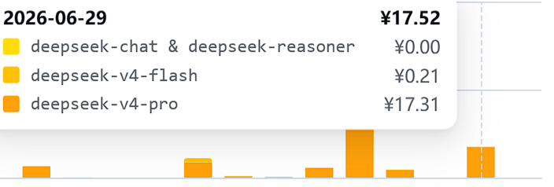

#  [深度调研skill](deepresearch)

    深度调研skill
    1，宽度：地理为止覆盖（尤其中国）、品类（开源/商业，不同产品品种等）等角度进行覆盖
    2，深度：深入技术范式、步骤、组件、优缺点；泛化分析等
    3，严肃性、准确性
        3.1 多角色，互相信息隔离，对抗、审查
        3.2 主编对比、审核研究员工
        3.3 第三方独立审计整体报告
        3.4 对引用很行对抗审计、出局覆盖率、可信性报告
        3.5 采用红蓝对抗审计方法
    4，阅读友好
        4.1 总编按金字塔结构汇报
        4.2 附录研究员原始报告
        4.3 附录第三方审计报告
        4.4 html结构化输出

    说明，建议使用
        1，3研究员，一个报告大概5~10元，
        2，多研究员质量并没有提升多少，建议日常入参 Agents=1 

## 安装方法
    
    在 ClaudeCode或Codex中输入  安装skill https://github.com/mmbbdddd/skills/tree/main/deepresearch  

## demo

 [VibeCoding 企业实践_report.html](VibeCoding%20%E4%BC%81%E4%B8%9A%E5%AE%9E%E8%B7%B5/VibeCoding%20%E4%BC%81%E4%B8%9A%E5%AE%9E%E8%B7%B5_report.html)
 

